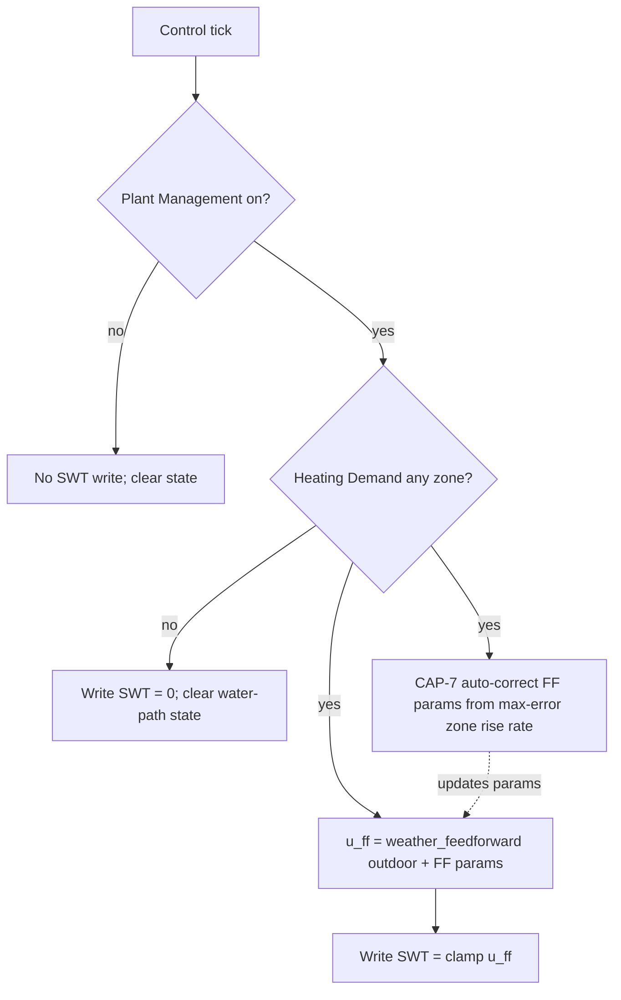
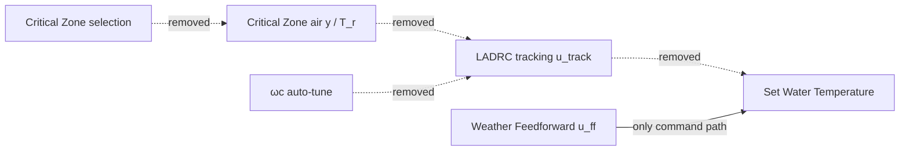

# Architecture diagrams

## Set Water Temperature law (target)

```mermaid
flowchart TD
  tick[Control tick]
  pm{Plant Management on?}
  hands[No SWT write; clear state]
  demand{Heating Demand any zone?}
  zero[Write SWT = 0; clear water-path state]
  ff[u_ff = weather_feedforward outdoor + FF params]
  clamp[Write SWT = clamp u_ff]
  ac[CAP-7 auto-correct FF params from max-error zone rise rate]
  tick --> pm
  pm -->|no| hands
  pm -->|yes| demand
  demand -->|no| zero
  demand -->|yes| ff --> clamp
  demand -->|yes| ac -.->|updates params| ff
```

## Explicitly removed from SWT path

```mermaid
flowchart LR
  cz[Critical Zone selection]
  air[Critical Zone air y / T_r]
  ladrc[LADRC tracking u_track]
  tune[ωc auto-tune]
  swt[Set Water Temperature]
  cz -.->|removed| air
  air -.->|removed| ladrc
  tune -.->|removed| ladrc
  ladrc -.->|removed| swt
  ff[Weather Feedforward u_ff] -->|only command path| swt
```
