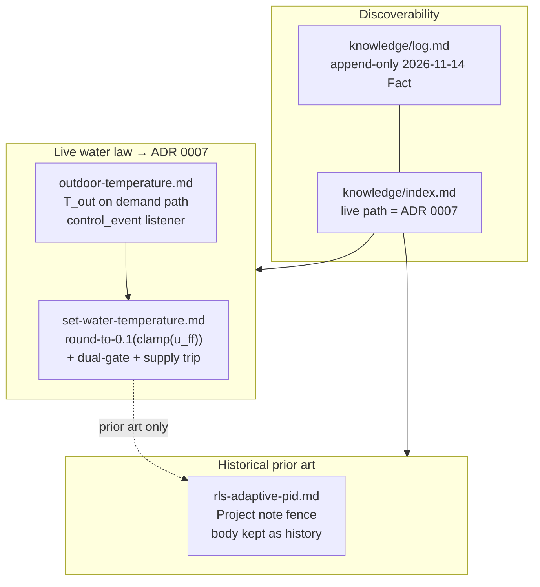

# Broad strokes diagram

Source: [broad-strokes.mmd](broad-strokes.mmd). Renders as Mermaid in Cursor/GitHub.

```mermaid
flowchart TB
  subgraph live["Live water law → ADR 0007"]
    SWT["set-water-temperature.md<br/>round-to-0.1(clamp(u_ff))<br/>+ dual-gate + supply trip"]
    OUT["outdoor-temperature.md<br/>T_out on demand path<br/>control_event listener"]
    OUT --> SWT
  end

  subgraph hist["Historical prior art"]
    RLS["rls-adaptive-pid.md<br/>Project note fence<br/>body kept as history"]
  end

  subgraph disc["Discoverability"]
    IDX["knowledge/index.md<br/>live path = ADR 0007"]
    LOG["knowledge/log.md<br/>append-only 2026-11-14 Fact"]
  end

  IDX --> live
  IDX --> hist
  SWT -.->|"prior art only"| RLS
  LOG --- IDX
```
